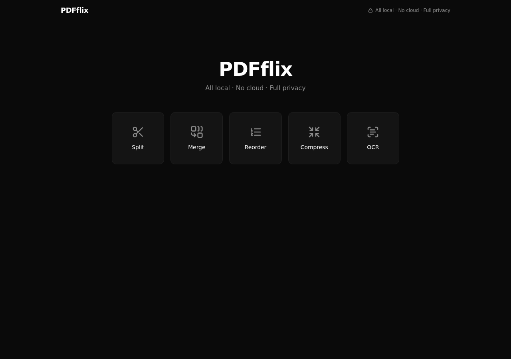
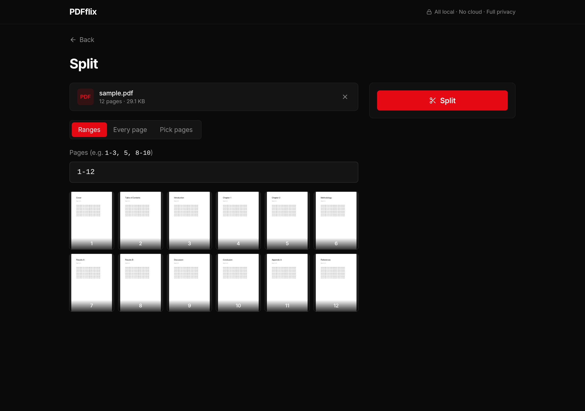
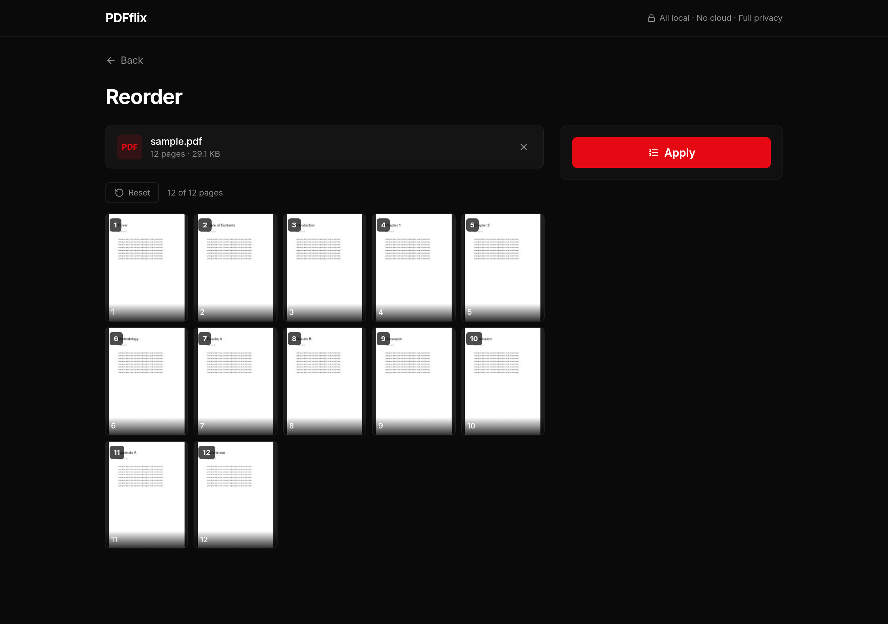
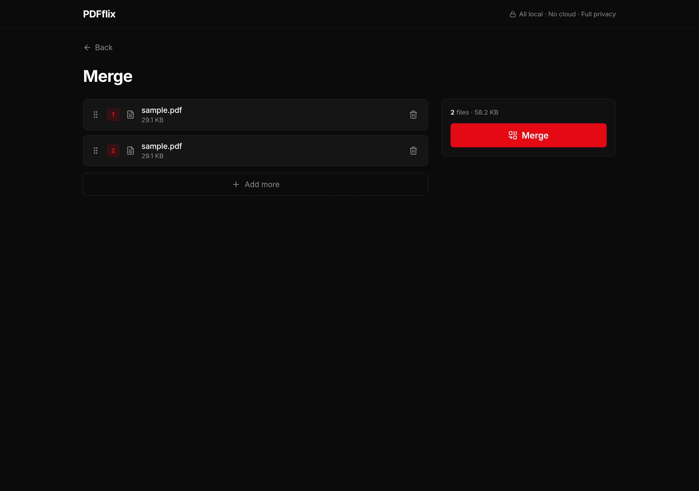
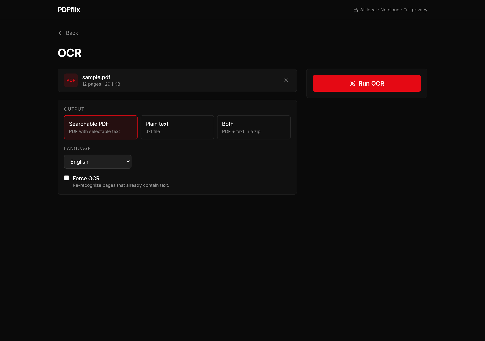
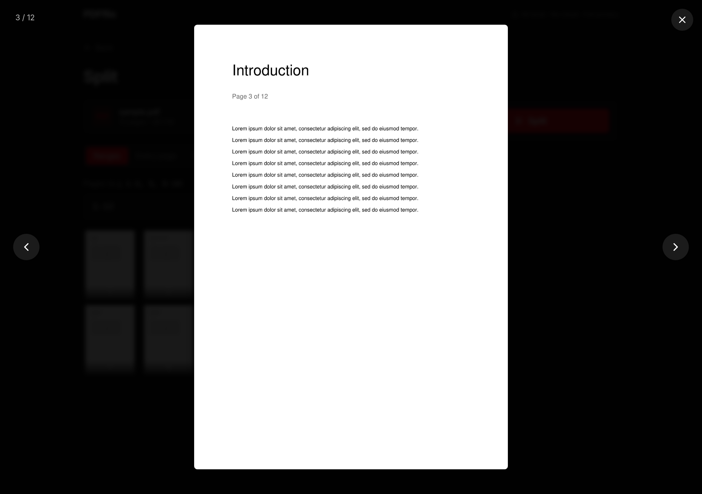

# PDFflix

> Self-hosted PDF tools for your Raspberry Pi. Split, merge, reorder, OCR.
> All local · No cloud · Full privacy.

<p align="center">
  
</p>

PDFflix is a small, fast PDF editor that runs entirely on a Raspberry Pi
(or any Linux box). Drop in a PDF and split, merge, rearrange, or OCR it —
no upload to a third-party service, no watermarks, no rate limits. The Pi
does the work; the browser just drives it.

## Features

| | |
|---|---|
| **Split** — by page range (`1-3, 5, 8-10`), every page, or pick individual pages from a thumbnail grid |  |
| **Pick pages** with a thumbnail grid; selected pages flow into a single output PDF |  |
| **Reorder** — drag thumbnails on a grid; duplicate or delete individual pages |  |
| **Merge** — drop multiple PDFs, drag rows to set the output order |  |
| **OCR** — searchable PDF, plain `.txt`, or both. 12 languages supported. Falls back to the existing text layer when a PDF already has one |  |
| **Page viewer** — click any thumbnail to open a full-screen lightbox; arrow keys navigate |  |

## Stack

| Layer | What |
|---|---|
| Backend | **FastAPI** + uvicorn (single async worker) |
| PDF engines | **pikepdf** (split / merge / reorder — lossless), **PyMuPDF** (thumbnails, full-page rendering, text extraction), **ocrmypdf** + **tesseract** (OCR with `--jobs N` parallelism) |
| Frontend | **React 18** + **Vite** + **TypeScript** + **Tailwind CSS**, **dnd-kit** for drag-and-drop, **lucide-react** icons |
| Hosting | systemd service on port 90, `CAP_NET_BIND_SERVICE` so it runs as `pi` (not root) |
| Bundle | ~87 KB gzipped JS, no PDF.js client-side, no framer-motion |

The backend serves the built static frontend on the same port — one process, one URL.

## Hardware

Tested on a **Raspberry Pi 5 (8 GB)** running Debian 12 (bookworm). A 50-page
scanned PDF goes through OCR in 30–90 s depending on image density.

## Install

```bash
# 1. System packages
sudo apt update
sudo apt install -y python3-venv python3-pip nodejs npm \
  tesseract-ocr ocrmypdf qpdf ghostscript libcap2-bin \
  librsvg2-bin

# 2. Clone
git clone git@github.com:myvibecodedapps/pdf-flix.git
cd pdf-flix

# 3. Backend deps
python3 -m venv venv
./venv/bin/pip install --upgrade pip wheel
./venv/bin/pip install -r backend/requirements.txt

# 4. Frontend build
cd frontend
npm install
npm run build
cd ..
cp -r frontend/dist static       # FastAPI serves from here

# 5. Job storage dir
sudo mkdir -p /var/lib/pdfflix/jobs
sudo chown $USER:$USER /var/lib/pdfflix /var/lib/pdfflix/jobs

# 6. systemd unit (port 90)
sudo cp deploy/pdfflix.service /etc/systemd/system/pdfflix.service
sudo systemctl daemon-reload
sudo systemctl enable --now pdfflix.service
```

Open `http://<your-pi>.local:90` and you're done.

## Architecture

- Each upload creates a **job directory** under `/var/lib/pdfflix/jobs/<uuid>/`
  containing the input PDF, cached thumbnails, and any output files.
- A background **janitor** task evicts jobs older than `PDFFLIX_JOB_TTL`
  (default 1 hour).
- Page thumbnails (`/api/jobs/{id}/thumb/{n}`) and full-size renders
  (`/api/jobs/{id}/page/{n}?w=N`) are rendered on demand by PyMuPDF and
  cached on disk.
- OCR uses `ocrmypdf --skip-text` by default, so pages that already have a
  text layer aren't redone; the sidecar `.txt` is post-processed to splice
  in the existing text layer for skipped pages, so a text export is always
  useful. A `Force OCR` checkbox flips to `--force-ocr`.

## Environment variables

| Var | Default | Purpose |
|---|---|---|
| `PDFFLIX_JOBS_DIR` | `/tmp/pdfflix-jobs` | Where job folders live |
| `PDFFLIX_STATIC_DIR` | `<repo>/static` | Built frontend |
| `PDFFLIX_MAX_UPLOAD_MB` | `500` | Upload cap |
| `PDFFLIX_JOB_TTL` | `3600` | Seconds before a job is evicted |

## Add to iPhone home screen

Open in Safari → Share → Add to Home Screen. The app icon, fullscreen
behavior, and safe-area handling for notched devices are all wired up via
`apple-touch-icon` + `manifest.webmanifest` + `env(safe-area-inset-*)`.

## Project layout

```
backend/
  app.py              FastAPI app — single file, ~250 lines
  requirements.txt
frontend/
  src/
    App.tsx           Home (4 tools) + tool router
    components/       SplitTool, MergeTool, ReorderTool, OcrTool, PageViewer, FileDrop, PageThumb
    lib/api.ts        Thin HTTP client
  public/icons/       Source SVG + rendered PNGs (favicon, apple-touch, PWA)
deploy/
  pdfflix.service     systemd unit
  shotter.js          Puppeteer harness that produced the README screenshots
docs/screenshots/     Captured from a Pi 5 in headless Chromium
```

## License

MIT.
